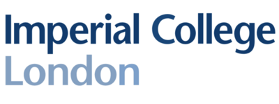

### Massachusetts Institute of Technology (MIT) (2023 - 2024)

##### *MEng Electrical Engineering and Computer Science*  

##### Exchange Year (Year 4) (To be completed)
- Machine Learning
- Quantitative Methods for Natural Language Processing
- Dynamic Programming and Reinforcement Learning
-  Final Year Project under the supervision of Dr. Mardavij Roozbehani
titled "Reinforcement Learning for Predicting and Shaping Electricity Demand of
Electric Vehicles"
  

### Imperial College London (2020 - 2023)

##### *MEng Electrical and Electronic Engineering*  

##### Year 1 - 85% (Dean's List for Academic Excellence - Top 5% of cohort)
- Programming for Engineers
- Mathematics for Engineers 1 (Calculus I-III, Linear Algebra I)
- Digital Electronics and Computer Architecture

##### Year 2 - 82% (Dean's List for Academic Excellence - Top 5% of cohort)
- Mathematics for Engineers 2 (Probability and Statistics, Linear Algebra II)
- Signals and Systems
- Power Electronics and Power Systems
- Circuits and Systems

##### Year 3 (To be assessed)
- Machine Learning
- Deep Learning
- Digital Signal Processing
- Statistical Signal Processing and Inference
- Electrical Energy Systems
  

### The English School Nicosia (2012 - 2019)
##### *A-Levels*
- Mathematics - A* (594/600)
- Further Mathematics- A* (589/600)
- Physics - A* - Highest National Mark
